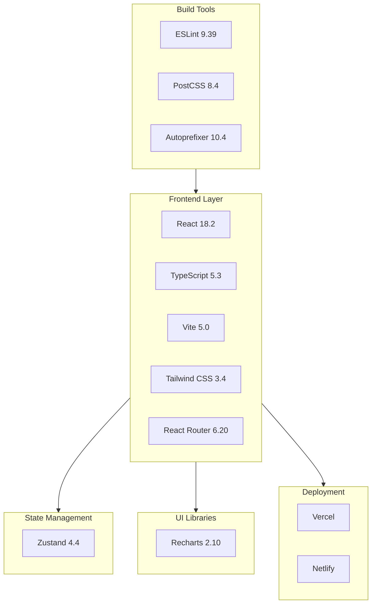
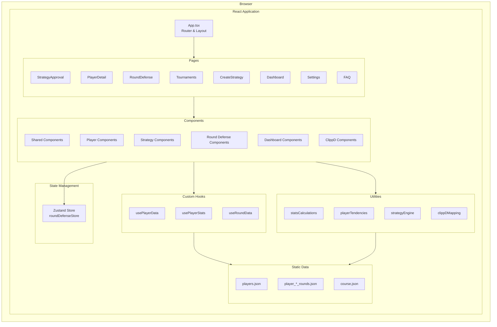
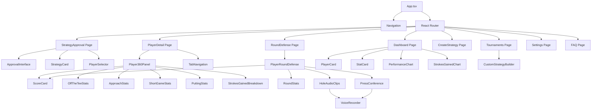
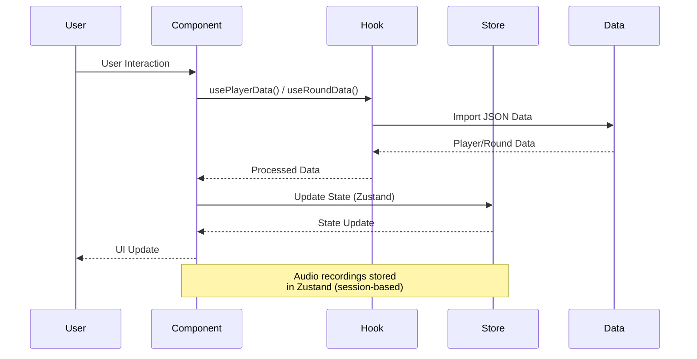
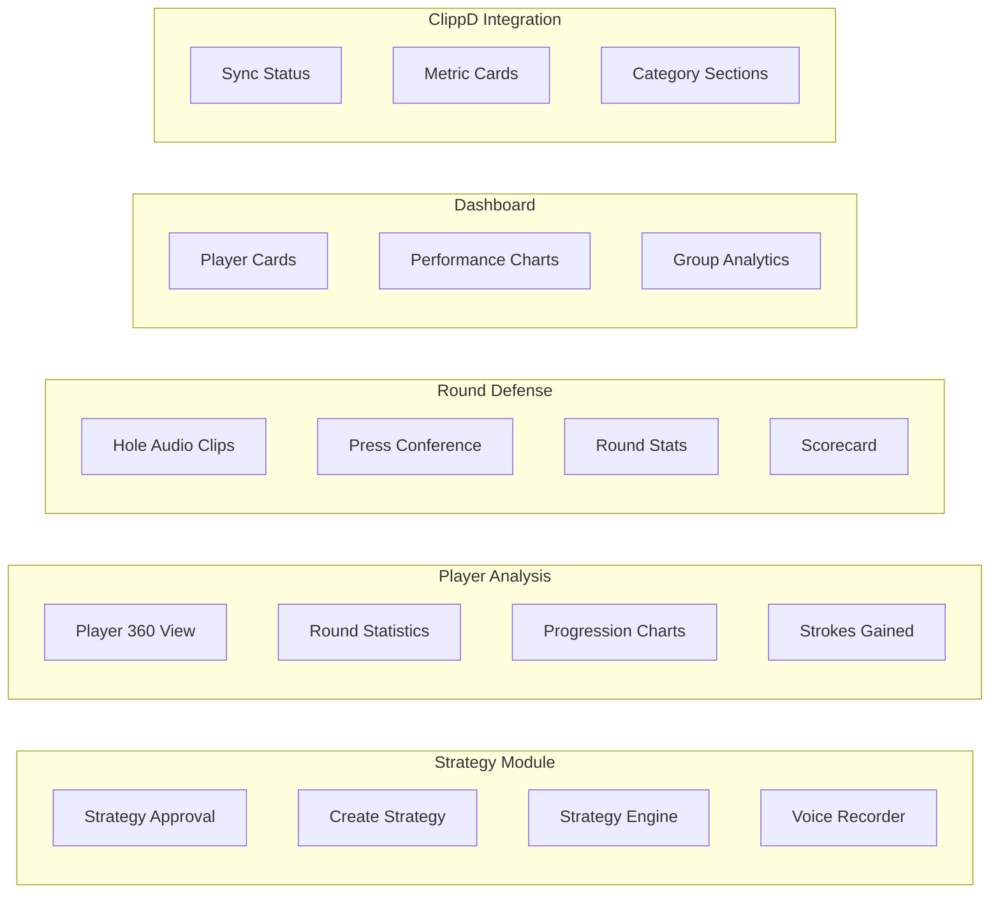
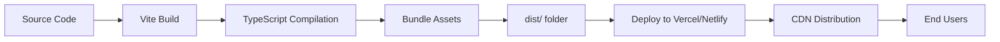

# GolfGo Coach Portal - Architecture & Stack Documentation

## Tech Stack Overview



## Application Architecture



## Component Hierarchy



## Data Flow Architecture



## Feature Modules



## Technology Stack Details

### Frontend Framework
- **React 18.2** - UI library with hooks and functional components
- **TypeScript 5.3** - Type-safe JavaScript
- **Vite 5.0** - Fast build tool and dev server

### Routing
- **React Router 6.20** - Client-side routing

### Styling
- **Tailwind CSS 3.4** - Utility-first CSS framework
- **PostCSS 8.4** - CSS processing
- **Autoprefixer 10.4** - Automatic vendor prefixes

### State Management
- **Zustand 4.4** - Lightweight state management (used for Round Defense audio storage)

### Data Visualization
- **Recharts 2.10** - Chart library for React

### Development Tools
- **ESLint 9.39** - Code linting
- **TypeScript ESLint** - TypeScript-specific linting rules

### Deployment
- **Vercel** - Primary deployment platform (configured)
- **Netlify** - Alternative deployment platform (configured)

## File Structure

```
src/
├── components/          # Reusable UI components
│   ├── clippd/         # ClippD integration components
│   ├── dashboard/      # Dashboard widgets
│   ├── player/         # Player analysis components
│   ├── round-defense/  # Round Defense feature
│   ├── shared/         # Shared components (Logo, Navigation)
│   └── strategy/       # Strategy-related components
├── pages/              # Page-level components (routes)
├── hooks/              # Custom React hooks
├── stores/             # Zustand state stores
├── utils/               # Utility functions
├── types/               # TypeScript type definitions
├── data/                # Static JSON data files
└── assets/             # Static assets (images, etc.)
```

## Data Architecture

### Static Data Storage
- **JSON Files** - All player and round data stored as static JSON files
- **Import Strategy** - Using Vite's `import.meta.glob` for dynamic imports

### State Management
- **Zustand Store** - Session-based storage for audio recordings
- **React State** - Component-level state for UI interactions
- **Custom Hooks** - Data fetching and processing logic

## Build & Deployment Flow



## Key Design Patterns

1. **Component Composition** - Small, reusable components
2. **Custom Hooks** - Data fetching and business logic separation
3. **Type Safety** - Comprehensive TypeScript types
4. **Utility Functions** - Pure functions for calculations
5. **Session State** - Zustand for temporary data (audio recordings)

## Performance Considerations

- **Code Splitting** - Vite handles automatic code splitting
- **Static Assets** - Optimized through Vite's build process
- **Lazy Loading** - React Router supports lazy loading (can be added)
- **Bundle Size** - Current bundle ~970KB (consider code splitting for production)

## Future Enhancements

1. **Backend API** - Replace static JSON with API endpoints
2. **Database** - Persistent storage for players, rounds, and audio
3. **Authentication** - User login and authorization
4. **Real-time Updates** - WebSocket for live data
5. **File Storage** - Cloud storage for audio recordings (S3, etc.)
