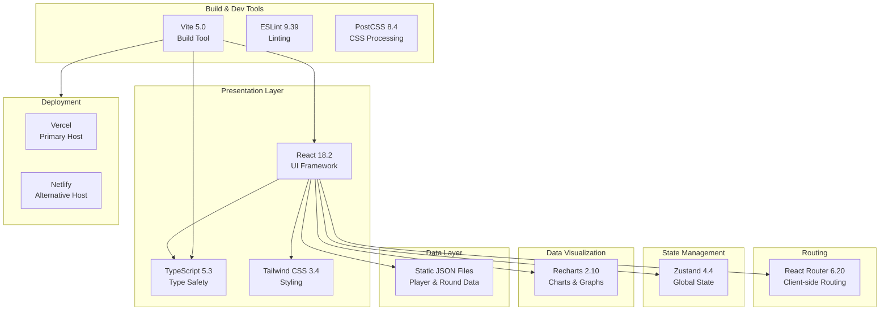

# GolfGo Coach Portal - Technology Stack

## Stack Visualization

## Layer Breakdown

### 🎨 Frontend Layer
- **React 18.2** - Modern UI library with hooks
- **TypeScript 5.3** - Type-safe development
- **Tailwind CSS 3.4** - Utility-first styling

### 🧭 Routing Layer
- **React Router 6.20** - Declarative routing

### 📊 State & Data Layer
- **Zustand 4.4** - Lightweight state management
- **Static JSON** - File-based data storage

### 📈 Visualization Layer
- **Recharts 2.10** - Chart components

### 🛠️ Development Layer
- **Vite 5.0** - Fast build tool
- **ESLint 9.39** - Code quality
- **PostCSS 8.4** - CSS processing

### 🚀 Deployment Layer
- **Vercel** - Optimized for React
- **Netlify** - Alternative platform

## Stack Summary

| Category | Technology | Version | Purpose |
|----------|-----------|---------|---------|
| Framework | React | 18.2 | UI Library |
| Language | TypeScript | 5.3 | Type Safety |
| Styling | Tailwind CSS | 3.4 | CSS Framework |
| Routing | React Router | 6.20 | Navigation |
| State | Zustand | 4.4 | Global State |
| Charts | Recharts | 2.10 | Data Visualization |
| Build | Vite | 5.0 | Build Tool |
| Linting | ESLint | 9.39 | Code Quality |
| Hosting | Vercel/Netlify | - | Deployment |

## Architecture Type

**Single Page Application (SPA)**
- Client-side rendered
- Static site generation
- No backend server required
- Deployed as static files
